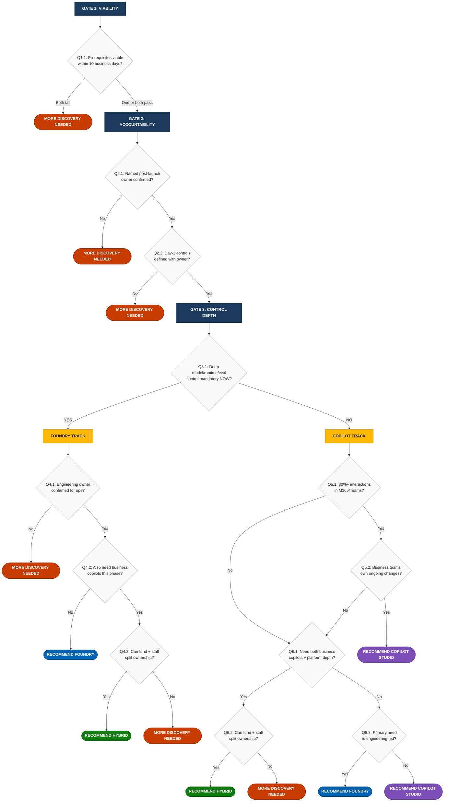

# Customer AI Platform Decision Framework

## What This Document Is
This is the decision tree for recommending one of four outcomes:
- **Copilot Studio** — Low-code, business-owned AI agents in M365/Teams
- **Microsoft Foundry** — Engineering-grade AI platform with full model control
- **Hybrid** — Both platforms running in parallel with split ownership
- **More Discovery Needed** — Blockers exist that must be resolved before a recommendation

It uses binary questions with explicit YES/NO criteria. Two facilitators given the same customer answers must arrive at the same outcome.

**Last refreshed: 2026-07-10**

## How To Use This Framework

**The diagram below is your map.** Each diamond shape is a question you ask the customer. Follow the arrows based on their answer. When you hit a colored rounded box, that's the recommendation.

**For each question**, scroll down to the matching section (same Gate number and Question number) to see:
- The exact YES/NO criteria to apply
- Example customer statements that count as YES or NO
- What routes where

### Rules
1. Ask each question in order following the arrows.
2. Apply the YES/NO criteria exactly as written.
3. Follow the routing instruction.
4. Stop at the first terminal outcome (colored box).

Do not skip questions. Do not reorder questions. Do not override routing.

---

## Decision Tree (Visual)

> **How to read this diagram:** Start at the top. Each gate (dark blue) leads to a question (diamond). Follow YES/NO arrows until you reach a colored outcome box. Then scroll to that Gate's detailed section below for the full criteria.

**Outcome Legend:**
| Color | Outcome | Meaning |
|---|---|---|
| Purple | **Copilot Studio** | Low-code, business-owned AI agents in M365/Teams |
| Blue | **Microsoft Foundry** | Engineering-grade AI platform with full model control |
| Green | **Hybrid** | Both platforms, split ownership model |
| Red | **More Discovery Needed** | Blockers exist; structured gap closure required |
| Yellow | **Track Routing** | Intermediate routing decision |

---

## Detailed Questions & Criteria

> Each section below corresponds to a question diamond in the diagram above. The Gate numbers match. Use these criteria to determine whether the answer is YES or NO.

---

### Gate 1: Viability

#### Q1.1: Are platform prerequisites Active or confirmable within 10 business days?

**What you're checking:** Can the customer actually USE the platform they'd need? Do the technical prerequisites exist?

| Platform | What Must Be True |
|---|---|
| **Foundry** | Azure subscription exists, RBAC assignable, target region/model available, engineering owner named |
| **Copilot Studio** | M365 tenant aligned, Copilot Studio licensing in place or purchasable, business owner named |

**Answer YES if:**
- Each prerequisite has a named owner who confirmed its status
- There's documented evidence (portal screenshot, admin email, system record)
- Any pending items have a committed date within 10 days

**Answer NO if:**
- Anyone says "we should be able to" or "probably" without proof
- No one owns a prerequisite
- No evidence exists — just verbal assurances

> **Example YES:** "Our Azure admin Sarah confirmed the subscription is active. She verified GPT-4.1 is available in East US 2. Screenshot attached."
>
> **Example NO:** "We think we have an Azure subscription somewhere. IT should be able to set it up."

**Where it routes:**
- NO for both platforms --> **More Discovery Needed** (stop)
- NO for one platform --> That platform is eliminated; continue to Q2.1
- YES for one or both --> Continue to Q2.1

---

#### Q1.2: Is at least one platform path still viable?

If Q1.1 eliminated one platform, that's fine — we continue with the survivor. If both failed, stop here.

**Where it routes:**
- Both failed --> **More Discovery Needed** (stop)
- At least one survived --> Continue to Q2.1 (constrained to viable path)

---

### Gate 2: Accountability

#### Q2.1: Is there a named person accountable for post-launch operations?

**What you're checking:** Someone specific (a human with a name) must own the solution after it ships. Not a team. Not "TBD."

**Answer YES if:**
- A specific individual is named (first and last name)
- That person has confirmed they accept this responsibility
- There's a defined escalation path if things go wrong

**Answer NO if:**
- The answer is vague ("IT will handle it," "we'll figure it out later")
- Someone is named but hasn't actually agreed to own it
- There's no escalation plan

> **Example YES:** "Marcus Chen, our platform engineering lead, has confirmed he'll own Foundry operations. He reports to the VP of Engineering."
>
> **Example NO:** "The DevOps team will probably take this on. We haven't talked to them yet."

**Where it routes:**
- NO --> **More Discovery Needed** (stop)
- YES --> Continue to Q2.2

---

#### Q2.2: Are day-1 mandatory controls explicitly defined?

**What you're checking:** Does the customer know EXACTLY what security/compliance requirements must be live on day 1? Vague "security matters" doesn't count.

**Controls each platform supports (from research):**

| Control | Copilot Studio | Foundry |
|---|---|---|
| Identity (Entra ID) | Yes | Yes (managed identity) |
| DLP policies | Yes | Via Azure Policy |
| VNet / Private endpoints | **No** | Yes |
| Customer-managed keys (CMK) | Yes | Yes |
| Audit logging | Purview + Sentinel | Azure Monitor |
| Data residency control | Geography-based (Microsoft-managed) | Region-specific (customer-controlled, 30+ regions) |
| Content safety filters | Platform-managed | Configurable per deployment |

**Answer YES if:**
- Customer names specific controls ("We need VNet isolation and CMK")
- Each control has an implementation plan ("We'll use private endpoints in East US 2")
- Each control has an owner ("Infosec lead Priya owns this")

**Answer NO if:**
- Customer says "security is important" but can't name specific controls
- Controls are named but there's no plan for implementing them
- No one owns the control implementation

> **Example YES:** "We require private endpoints, CMK, and SOC 2 audit trails. Our CISO's team owns security controls and has documented the requirements."
>
> **Example NO:** "Security is a top priority for us. We'll need to make sure it's secure."

**Where it routes:**
- NO --> **More Discovery Needed** (stop)
- YES --> Continue to Q3.1

---

### Gate 3: Control Depth (Primary Routing)

#### Q3.1: Is deep model, runtime, or evaluation control mandatory in this phase?

**What you're checking:** This is THE key routing question. Does the customer need engineering-grade control that only Foundry provides? Or are Copilot Studio's built-in capabilities sufficient?

**Use this table** — if the customer's need appears in the left column, the answer is YES:

| Customer says they need... | Foundry provides | Copilot Studio provides | Verdict |
|---|---|---|---|
| "We must choose between different AI models" | Full model catalog (GPT-5, o3, DeepSeek, etc.) | Single platform-managed model | **YES** |
| "We need to evaluate model quality before release" | Batch eval, custom graders, AI Red Teaming | Not available | **YES** |
| "We need to write custom orchestration code" | SDK (Python, C#, JS, Java) + MCP | Generative orchestration (AI-managed) | **YES** |
| "We need guaranteed latency/throughput SLOs" | PTU, custom monitoring, autoscaling | Platform quotas only | **YES** |
| "We need to fine-tune a model on our data" | SFT, DPO, RFT | Not available | **YES** |
| "We need private networking / VNet" | VNet + private endpoints | Not available (SaaS) | **YES** |
| "We need agents that call other agents with custom routing logic" | Code-controlled delegation | AI-selected only (by description) | **YES** |

**But if the customer says...**
| Customer says they need... | Copilot Studio handles it | Verdict |
|---|---|---|
| "We need an agent that answers questions from our SharePoint" | Generative answers + 500 knowledge sources | **NO** |
| "We need it to call APIs and trigger workflows" | Agent Flows + 1000+ connectors + HTTP actions | **NO** |
| "We need multiple agents working together" | Child/connected agents (AI-selected) | **NO** |
| "We need it to handle complex multi-step tasks" | Generative orchestration chains tools/topics automatically | **NO** |
| "We need it in Teams" | One-click publish | **NO** |

**Answer YES if:**
- Customer provides a concrete example mapping to the first table
- The need is for THIS phase (not "someday")

**Answer NO if:**
- Customer can't give a concrete example
- Their examples are covered by the second table
- They say "we might need this later" (future ≠ now)

> **Example YES:** "We must compare GPT-5 against Mistral for accuracy on our legal documents before choosing. We need evaluation scores above 0.85 on our test set."
>
> **Example NO:** "We want an intelligent agent that can answer employee questions from our SharePoint site and create tickets in ServiceNow."

**Where it routes:**
- YES --> **Foundry Track** (Q4.1)
- NO --> **Copilot Track** (Q5.1)

---

### Gate 4: Foundry Track

#### Q4.1: Is a named engineering owner confirmed for platform operations?

**What you're checking:** Foundry requires an engineering team to run it — all changes need code deployments, SDK work, and structured releases. Is someone confirmed to do this?

**Answer YES if:**
- A specific engineer/lead is named
- They've confirmed capacity for runtime ops, incident response, and releases
- There's a support/on-call model defined

**Answer NO if:**
- No one is named
- Someone's named but hasn't confirmed they have bandwidth
- There's no support model

> **Example YES:** "Alex Rivera, senior platform engineer, will own the Foundry runtime. He has 3 engineers on his team and they'll rotate on-call weekly."
>
> **Example NO:** "We'll hire someone for this. We're posting the role next quarter."

**Where it routes:**
- NO --> **More Discovery Needed** (stop)
- YES --> Continue to Q4.2

---

#### Q4.2: Does the organization also need business-facing copilots in this same phase?

**What you're checking:** Beyond the engineering platform, do they ALSO need low-code agents owned by business teams (HR bots, IT helpdesk, etc.) delivered at the same time?

**Answer YES if:**
- They've named specific business-facing use cases (FAQ bot, process automation)
- Those use cases need business-team ownership (not engineering)
- They're scoped for the same timeline as the Foundry work

**Answer NO if:**
- No business-facing copilot use cases exist right now
- Business use cases are planned for a later phase
- All use cases are engineering-owned

> **Example YES:** "While engineering builds our custom RAG pipeline in Foundry, HR also needs an employee benefits bot in Teams by Q3. The HR team will own it."
>
> **Example NO:** "Everything we're building is API-first and engineering-owned."

**Where it routes:**
- NO --> **Recommend Microsoft Foundry** (stop)
- YES --> Continue to Q4.3

---

#### Q4.3: Can the organization fund and staff split ownership simultaneously?

**What you're checking:** Running both platforms means two workstreams, two budgets, two owners, and a coordination model. Can they actually do that?

**Answer YES if:**
- Budget confirmed for both (Copilot Credits + Azure compute/tokens)
- Named owner for each workstream
- Defined coordination model between the two

**Answer NO if:**
- Budget covers only one
- Only one person spans both (they'll be overwhelmed)
- No plan for how the workstreams talk to each other

> **Example YES:** "We have budget approved for both. Marcus owns Foundry, Lisa owns Copilot Studio. They meet weekly to align on shared knowledge sources."
>
> **Example NO:** "We have one budget line for AI. We'll figure out who does what."

**Where it routes:**
- YES --> **Recommend Hybrid** (stop)
- NO --> **More Discovery Needed** (stop)

---

### Gate 5: Copilot Track

#### Q5.1: Will 80%+ of end-user interactions occur in M365 or Teams channels?

**What you're checking:** Is the primary user experience inside Microsoft 365? Copilot Studio shines here (one-click Teams publish, native M365 Copilot extension). Foundry requires Bot Framework integration for Teams.

**Answer YES if:**
- Primary UX is Teams, Outlook, SharePoint, or M365 Copilot
- Customer can name the specific channel(s)

**Answer NO if:**
- Primary UX is a custom web app, mobile app, or non-M365 surface
- Customer can't identify the primary channel
- Usage is evenly split across many surfaces

> **Example YES:** "Our 5,000 employees will use this through Teams. That's where they live all day."
>
> **Example NO:** "We need this embedded in our customer-facing React web app."

**Where it routes:**
- YES --> Continue to Q5.2
- NO --> Continue to Q6.1 (Ambiguous Path)

---

#### Q5.2: Can business teams own ongoing changes without engineering?

**What you're checking:** After launch, will the business team (not engineers) maintain the agent? Copilot Studio makes this possible. Foundry does not.

**Answer YES if:**
- A business owner is named for post-launch changes
- They have skills or a training plan for Copilot Studio
- Changes don't require code deployments

**Answer NO if:**
- No business owner is identified
- Changes will require engineering releases
- Business team lacks skills and there's no training plan

> **Example YES:** "Our Knowledge Manager, Jen, will update the agent's topics and knowledge sources weekly. She's taking the Copilot Studio admin training."
>
> **Example NO:** "Our developers will need to update the agent whenever the process changes."

**Where it routes:**
- YES --> **Recommend Copilot Studio** (stop)
- NO --> Continue to Q6.1 (Ambiguous Path)

---

### Gate 6: Ambiguous Path Resolution

#### Q6.1: Do they need BOTH business copilots AND platform depth in the same phase?

**What you're checking:** Are there two distinct types of work — low-code business automation AND custom engineering — both needed now?

**Answer YES if:**
- Both types of use cases are identified
- Both are scoped for the same delivery timeline

**Answer NO if:**
- Only one type exists
- The second type is planned for later

**Where it routes:**
- YES --> Continue to Q6.2
- NO --> Continue to Q6.3

---

#### Q6.2: Can they fund and staff split ownership?

(Same as Q4.3 above.)

**Where it routes:**
- YES --> **Recommend Hybrid** (stop)
- NO --> **More Discovery Needed** (stop)

---

#### Q6.3: Is the primary need engineering-led?

**What you're checking:** For the dominant use case, does it need code-level SDK orchestration, model control, PTU/SLOs, private networking, or evaluation pipelines?

**Answer YES if:**
- Dominant use case needs imperative code orchestration (not just generative orchestration)
- OR needs model selection/evaluation
- OR needs PTU/custom SLOs
- OR needs VNet/private endpoints

**Answer NO if:**
- Dominant use case is achievable with Copilot Studio's generative orchestration, connectors, Agent Flows, child agents, and knowledge grounding

> **Example YES:** "We need to build a custom document processing pipeline with model evaluation gates and deploy behind our VNet."
>
> **Example NO:** "We need an agent for our field sales team that pulls data from Salesforce and answers questions about accounts."

**Where it routes:**
- YES --> **Recommend Microsoft Foundry** (stop)
- NO --> **Recommend Copilot Studio** (stop)

---

## More Discovery Needed Protocol

More Discovery Needed is not a deferral. It is a structured risk-reduction state with mandatory deliverables and a target exit date.

### Entry
Any decision tree path that terminates at More Discovery Needed.

### Required Actions
1. Document which question(s) caused the outcome.
2. For each blocking question, identify what must change for the answer to become YES.
3. Assign an owner and due date for each change.
4. Set a reassessment date (maximum 30 days from entry).
5. Re-run the decision tree on the reassessment date with updated evidence.

### Exit
Re-run the decision tree. If the blocking questions now route to a platform outcome, More Discovery Needed is complete.

### Governance
- Open-ended discovery is not permitted. If the reassessment date passes without resolution, escalate to architecture board.
- Each discovery cycle must produce a gap register with owner/date/validation method.

---

## Confidence Assessment (Post-Outcome)

After the tree produces an outcome, assess confidence:

- **High**: All questions answered with verified evidence. No "within 10 days" dependencies remain.
- **Medium**: Outcome is clear but one or more answers depend on "within 10 days" confirmations.
- **Low**: Outcome is clear but significant evidence gaps remain open.

Confidence does not change the outcome. It determines follow-up urgency.

---

## Evidence Standard

For every YES/NO answer recorded in the worksheet:
- Capture the customer's exact statement.
- Record who provided the answer (name and role).
- Record the evidence source (system record, verbal confirmation, document reference).
- If evidence source is verbal only, mark as "requires written confirmation" and add to follow-up tracker.

---

## Internal Coaching Notes (Separate From Operating Rules)

These notes are for facilitator training. They do not modify the decision tree.

- Lead with outcomes, not platforms. Ask what must be true in 90 days.
- Treat unknowns as NO answers until evidence converts them.
- Do not force certainty. More Discovery Needed prevents bad commitments.
- Ask for one concrete example per claim. No example means NO.
- Separate requirement from preference. Preferences do not route decisions.
