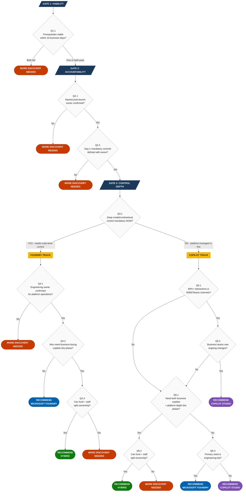

# Customer AI Platform Decision Framework

## What This Document Is
This is the decision tree for recommending one of four outcomes:
- Recommend Copilot Studio
- Recommend Microsoft Foundry
- Recommend a Hybrid of Both Copilot Studio and Microsoft Foundry
- More Discovery Needed

It uses binary questions with explicit YES/NO criteria. Two facilitators given the same customer answers must arrive at the same outcome.

**Last refreshed: 2026-07-10**

## How To Use This Framework
1. Ask each question in order.
2. Apply the YES/NO criteria exactly as written.
3. Follow the routing instruction.
4. Stop at the first terminal outcome.

Do not skip questions. Do not reorder questions. Do not override routing.

---

## Decision Tree (Visual)

**Outcome Legend:**
| Color | Outcome | Meaning |
|---|---|---|
| Purple | **Copilot Studio** | Low-code, business-owned AI agents in M365/Teams |
| Blue | **Microsoft Foundry** | Engineering-grade AI platform with full model control |
| Green | **Hybrid** | Both platforms, split ownership model |
| Red | **More Discovery Needed** | Blockers exist; structured gap closure required |
| Yellow | **Track Routing** | Intermediate routing decision |

---

## Decision Tree (Detailed Questions)

### Gate 1: Viability

**Question 1.1: Are all required platform prerequisites either Active or confirmable within 10 business days?**

Required prerequisites (based on platform research):
- **For Foundry path:** Azure subscription exists, Foundry RBAC is assignable, target region/model/features are available (30+ regions; verify via region support docs), named engineering owner identified.
- **For Copilot Studio path:** M365 tenant is aligned, Copilot Studio licensing (Copilot Credits / message packs) is in place or purchasable, named business owner identified.

YES criteria (all must be true):
- Each prerequisite has a named owner who confirmed its status.
- Evidence source is documented (system record, admin confirmation, or portal verification).
- Any "within 10 days" item has a committed target date.

NO criteria (any one is sufficient):
- Any required prerequisite has no owner.
- Any required prerequisite has no evidence source.
- Any required prerequisite has no committed date and is not currently active.
- Customer states "we should be able to" or "probably" without verification.

Routing:
- If NO for Foundry prerequisites only --> Foundry is eliminated. Continue to Question 1.2.
- If NO for Copilot prerequisites only --> Copilot Studio is eliminated. Continue to Question 1.2.
- If NO for both --> **OUTCOME: More Discovery Needed.** Stop.
- If YES for both --> Continue to Question 2.1.

---

**Question 1.2: Is at least one platform path still viable?**

YES criteria:
- At least one platform (Copilot Studio or Foundry) passed prerequisite validation.

NO criteria:
- Both platforms failed prerequisite validation.

Routing:
- If NO --> **OUTCOME: More Discovery Needed.** Stop.
- If YES --> Continue to Question 2.1 (constrained to the viable path).

---

### Gate 2: Accountability

**Question 2.1: Is there a named person accountable for post-launch operations?**

YES criteria (all must be true):
- A specific individual (not a team name, not "TBD") is identified.
- That person has confirmed they accept this accountability.
- Their role and escalation path are documented.

NO criteria (any one is sufficient):
- Owner is unnamed ("IT will handle it," "we'll figure that out").
- Owner is named but has not confirmed acceptance.
- No escalation path exists.

Routing:
- If NO --> **OUTCOME: More Discovery Needed.** Stop.
- If YES --> Continue to Question 2.2.

---

**Question 2.2: Are day-1 mandatory controls explicitly defined?**

Day-1 mandatory controls means: security, compliance, or governance requirements that must be in place before the solution goes live.

Examples by platform (from research):
- **Copilot Studio supports:** Entra ID auth, DLP policies, environment isolation, CMK, Purview audit logs, Sentinel monitoring, sensitivity labels, Customer Lockbox.
- **Foundry supports:** Azure RBAC, VNet/private endpoints, CMK, content safety filters, Azure Policy, Azure Monitor audit logging, data residency (30+ regions), managed identity.
- **Only Foundry supports:** Private networking (VNet integration), region-specific data residency control, custom content safety configuration.

YES criteria (all must be true):
- Customer has stated specific controls by name.
- Each control has a defined implementation approach.
- Each control has a named owner.

NO criteria (any one is sufficient):
- Customer says "security is important" without naming specific controls.
- Controls are named but no implementation approach exists.
- Controls are named but no owner is assigned.

Routing:
- If NO --> **OUTCOME: More Discovery Needed.** Stop.
- If YES --> Continue to Question 3.1.

---

### Gate 3: Control Depth (Primary Routing)

**Question 3.1: Is deep model, runtime, or evaluation control mandatory in this phase?**

"Deep control" means the customer requires capabilities that Copilot Studio CANNOT provide (based on current research). Specifically, ANY of:

| Deep Control Need | What Foundry Provides | What Copilot Studio Provides |
|---|---|---|
| Select, compare, or switch between foundation models | Extensive model catalog (GPT-5 series, o3, DeepSeek, Meta, Mistral, model-router) | Single platform-managed model (no choice) |
| Structured evaluation pipelines before release | Batch eval, custom graders, quality gates, AI Red Teaming Agent | Not available |
| Imperative code-level orchestration | SDK in Python, C#, JavaScript, Java + MCP Server | Generative orchestration (AI-managed, not code-controlled) |
| Custom SLOs on model inference | Custom monitoring, autoscaling, PTU for guaranteed throughput | Platform-managed quotas only |
| Fine-tune a model | SFT, DPO, RFT with dataset curation from traces | Not available |
| Programmatic multi-agent routing | Code-controlled agent-to-agent delegation with custom logic | Child/connected agents (AI-selected by description only) |
| Private networking | VNet integration, private endpoints | Not available (SaaS) |

**Important:** Copilot Studio now supports generative orchestration (AI-selected tools/topics/agents), child/connected agents, 500 knowledge sources, and Agent Flows. If the customer's needs are met by these capabilities, Q3.1 = NO.

YES criteria:
- Customer provides at least one concrete example of a control they must exercise in this phase.
- The example maps to the "Deep Control Need" column above and cannot be satisfied by Copilot Studio.

NO criteria:
- Customer cannot provide a concrete example.
- Customer's examples can be satisfied by Copilot Studio's generative orchestration, connectors, knowledge grounding, child agents, or Agent Flows.
- Customer says "we might need this later" (future need is not current-phase mandatory).

Routing:
- If YES --> Continue to Question 4.1 (Foundry track).
- If NO --> Continue to Question 5.1 (Copilot track).

---

### Gate 4: Foundry Track

**Question 4.1: Is a named engineering owner confirmed for platform operations?**

Context (from research): Foundry requires engineering team ownership -- all changes require code deployment, SDK development (Python/C#/JS/Java), and structured release governance. There is no self-service portal for non-technical users.

YES criteria (all must be true):
- A specific engineer or engineering lead is named.
- They have confirmed capacity to own runtime, incident response, and release governance.
- There is a defined on-call or support model.

NO criteria (any one is sufficient):
- No engineering owner is named.
- Named owner has not confirmed capacity.
- No support model exists.

Routing:
- If NO --> **OUTCOME: More Discovery Needed.** Stop.
- If YES --> Continue to Question 4.2.

---

**Question 4.2: Does the organization also require business-facing copilot experiences in this same phase?**

"Business-facing copilot" means: low-code, business-owned conversational or workflow automation delivered through M365/Teams channels in the same delivery phase. Examples: HR FAQ bot, IT helpdesk, employee self-service, internal process automation with Agent Flows.

YES criteria:
- Customer has identified specific business-facing use cases that must be delivered concurrently.
- These use cases require business-team ownership (not engineering ownership).
- These use cases are scoped for the same delivery timeline.

NO criteria:
- No concurrent business-facing copilot use cases exist.
- Business use cases are planned for a later phase.
- All use cases are engineering-owned.

Routing:
- If YES --> Continue to Question 4.3.
- If NO and Foundry prerequisites passed --> **OUTCOME: Recommend Microsoft Foundry.** Stop.
- If NO and Foundry prerequisites failed --> **OUTCOME: More Discovery Needed.** Stop.

---

**Question 4.3: Can the organization fund and staff split ownership (business team + engineering team) simultaneously?**

Context (from research): Hybrid requires two parallel workstreams:
- Copilot Studio: Copilot Credits licensing, business admin, Power Platform environment.
- Foundry: Azure subscription, engineering team, SDK development, quota tier management.

YES criteria (all must be true):
- Budget exists for both a Copilot Studio workstream and a Foundry workstream.
- Named owners exist for each workstream.
- A governance model is defined for how the two workstreams coordinate.

NO criteria (any one is sufficient):
- Budget covers only one workstream.
- Only one owner exists across both.
- No coordination model is defined.

Routing:
- If YES --> **OUTCOME: Recommend a Hybrid of Both Copilot Studio and Microsoft Foundry.** Stop.
- If NO --> **OUTCOME: More Discovery Needed.** Stop.

---

### Gate 5: Copilot Track

**Question 5.1: Will 80% or more of end-user interactions occur in M365 or Teams channels?**

Context (from research): Copilot Studio provides one-click publish to Teams, native M365 Copilot extension (declarative agent/plugin), and web chat widget. Foundry requires Bot Framework integration for Teams -- it is not native.

YES criteria:
- Customer confirms the primary user experience is Teams, Outlook, SharePoint, or other M365 surface.
- Customer can name the specific channel(s) where users will interact.

NO criteria:
- Primary interaction is a custom web app, mobile app, or non-M365 surface.
- Customer cannot identify the primary channel.
- Usage is split without a dominant channel.

Routing:
- If YES --> Continue to Question 5.2.
- If NO --> Continue to Question 6.1.

---

**Question 5.2: Can business teams own ongoing configuration and change cycles without engineering dependency?**

Context (from research): Copilot Studio enables business-user self-service -- visual topic designer, knowledge source updates, instruction edits, Agent Flows -- all without code deployment. Foundry requires engineering for all changes.

YES criteria (all must be true):
- A business owner is named for post-launch content and configuration changes.
- The business owner has the skills or training plan to manage Copilot Studio.
- Change cycles do not require code deployments or engineering release processes.

NO criteria (any one is sufficient):
- No business owner is identified for post-launch changes.
- Changes require engineering releases.
- The business team lacks skills and no training plan exists.

Routing:
- If YES and Copilot prerequisites passed --> **OUTCOME: Recommend Copilot Studio.** Stop.
- If YES and Copilot prerequisites failed --> **OUTCOME: More Discovery Needed.** Stop.
- If NO --> Continue to Question 6.1.

---

### Gate 6: Ambiguous Path Resolution

**Question 6.1: Does the use case require both rapid business copilots AND engineered AI platform depth in the same phase?**

YES criteria (all must be true):
- There are identified business-workflow use cases that need low-code, business-owned delivery.
- There are identified platform-engineering use cases that need custom model control, orchestration, or evaluation.
- Both sets of use cases are scoped for the same delivery phase.

NO criteria:
- Only one type of use case exists.
- The second type is planned for a future phase.

Routing:
- If YES --> Continue to Question 6.2.
- If NO --> Continue to Question 6.3.

---

**Question 6.2: Can the organization fund and staff split ownership simultaneously?**

(Same criteria as Question 4.3.)

Routing:
- If YES --> **OUTCOME: Recommend a Hybrid of Both Copilot Studio and Microsoft Foundry.** Stop.
- If NO --> **OUTCOME: More Discovery Needed.** Stop.

---

**Question 6.3: Is the primary need engineering-led with custom orchestration, model control, or strict runtime governance?**

YES criteria (any one is sufficient):
- The dominant use case requires imperative code-level orchestration (SDK, not generative orchestration).
- The dominant use case requires model selection/evaluation control.
- The dominant use case requires enforced SLOs, PTU, or custom observability beyond Application Insights.
- The dominant use case requires private networking (VNet/private endpoints).

NO criteria:
- The dominant use case is workflow automation, knowledge retrieval, or conversational assistance achievable with Copilot Studio's generative orchestration, connectors, Agent Flows, and child agents.

Routing:
- If YES and Foundry prerequisites passed --> **OUTCOME: Recommend Microsoft Foundry.** Stop.
- If YES and Foundry prerequisites failed --> **OUTCOME: More Discovery Needed.** Stop.
- If NO and Copilot prerequisites passed --> **OUTCOME: Recommend Copilot Studio.** Stop.
- If NO and Copilot prerequisites failed --> **OUTCOME: More Discovery Needed.** Stop.

---

## More Discovery Needed Protocol

More Discovery Needed is not a deferral. It is a structured risk-reduction state with mandatory deliverables and a target exit date.

### Entry
Any decision tree path that terminates at More Discovery Needed.

### Required Actions
1. Document which question(s) caused the outcome.
2. For each blocking question, identify what must change for the answer to become YES.
3. Assign an owner and due date for each change.
4. Set a reassessment date (maximum 30 days from entry).
5. Re-run the decision tree on the reassessment date with updated evidence.

### Exit
Re-run the decision tree. If the blocking questions now route to a platform outcome, More Discovery Needed is complete.

### Governance
- Open-ended discovery is not permitted. If the reassessment date passes without resolution, escalate to architecture board.
- Each discovery cycle must produce a gap register with owner/date/validation method.

---

## Confidence Assessment (Post-Outcome)

After the tree produces an outcome, assess confidence:

- **High**: All questions answered with verified evidence. No "within 10 days" dependencies remain.
- **Medium**: Outcome is clear but one or more answers depend on "within 10 days" confirmations.
- **Low**: Outcome is clear but significant evidence gaps remain open.

Confidence does not change the outcome. It determines follow-up urgency.

---

## Evidence Standard

For every YES/NO answer recorded in the worksheet:
- Capture the customer's exact statement.
- Record who provided the answer (name and role).
- Record the evidence source (system record, verbal confirmation, document reference).
- If evidence source is verbal only, mark as "requires written confirmation" and add to follow-up tracker.

---

## Internal Coaching Notes (Separate From Operating Rules)

These notes are for facilitator training. They do not modify the decision tree.

- Lead with outcomes, not platforms. Ask what must be true in 90 days.
- Treat unknowns as NO answers until evidence converts them.
- Do not force certainty. More Discovery Needed prevents bad commitments.
- Ask for one concrete example per claim. No example means NO.
- Separate requirement from preference. Preferences do not route decisions.
